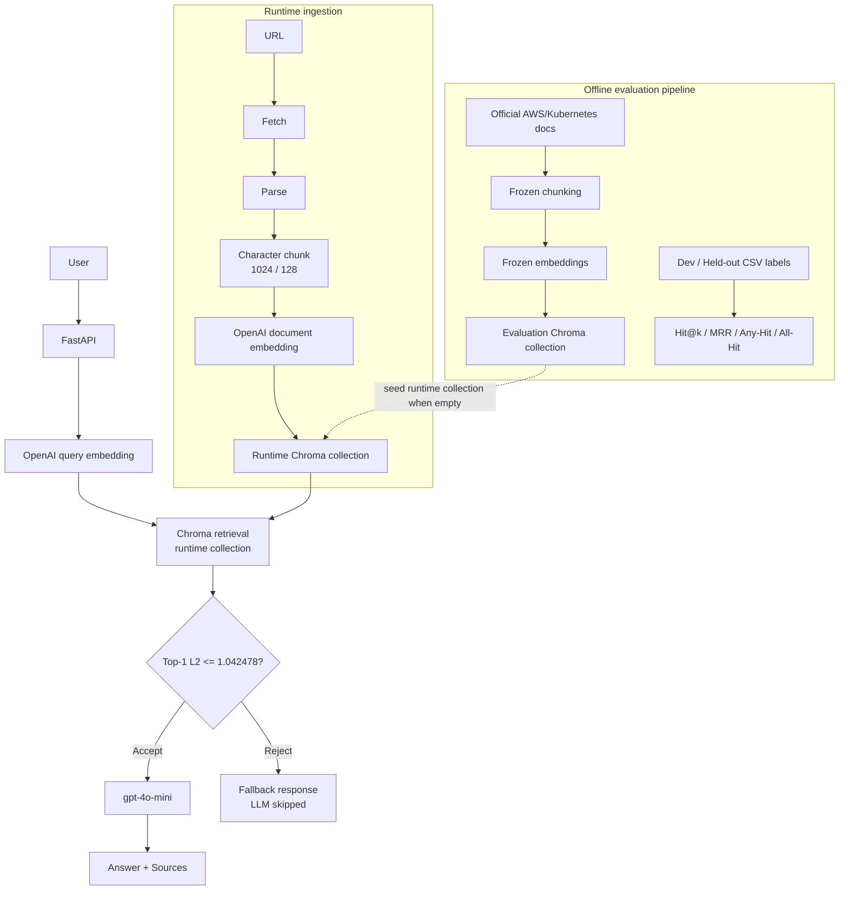

# CloudOps RAG

[English](./README.md) | **한국어**

AWS 및 Kubernetes 공식 트러블슈팅 문서를 대상으로 구축한 evaluation-driven RAG 시스템입니다. 단순히 RAG 파이프라인을 연결하는 데서 끝내지 않고, Retrieval과 Answer Quality를 분리해 측정하고, 실패 사례를 분석한 뒤 개선 가설을 controlled experiment로 검증했습니다.

FastAPI, Docker, Runtime ingestion, Prometheus-compatible monitoring까지 연결해 재현 가능한 서비스 형태로 구성했습니다. 이 README는 한국 기업의 Backend, Infra, Cloud, DevOps, AI/RAG 직무 관점에서 프로젝트의 문제의식, 평가 결과, 한계를 빠르게 이해할 수 있도록 정리한 공개 문서입니다.

프로젝트 흐름은 다음과 같습니다.

```text
Built -> Measured -> Compared -> Frozen -> Held-out Validated
-> Answer Evaluated -> Failure Analyzed -> Improvement Hypothesis Tested
-> Served -> Monitored
```

## 핵심 결과

Frozen Configuration은 다음과 같습니다.

```text
chunk_size = 1024
chunk_overlap = 128
chunk_unit = character
embedding = OpenAI text-embedding-3-small
vector DB = Chroma
retrieval_top_k = 5
threshold = 1.042478
generation = gpt-4o-mini
```

Post-hoc per-document cap=2 실험은 Frozen Configuration에 포함하지 않았습니다.

| 영역 | 결과 |
|---|---|
| Corpus | AWS/Kubernetes 공식 트러블슈팅 문서 20개 |
| Retrieval evaluation dataset | 총 50문항 |
| Development split | 40문항: 36 in-scope, 4 out-of-scope |
| Held-out split | 10문항: 8 in-scope, 2 out-of-scope |
| Frozen Dev retrieval | Hit@1 = 27/36, Hit@3 = 33/36, Hit@5 = 33/36 |
| Held-out retrieval | Hit@1 = 7/8, Hit@3 = 8/8, Hit@5 = 8/8, MRR = 0.9375 |
| Dev threshold/fallback | 36/36 in-scope accepted, 4/4 OOS rejected |
| Held-out threshold/fallback | 8/8 in-scope accepted, 2/2 OOS rejected |
| Answer diagnostic | 14 questions: 11 generated answers, 3 OOS fallback |
| Human answer scores | Correctness 15/22 (1.36/2), Completeness 13/22 (1.18/2), Faithfulness 21/22 (1.91/2), Source Support 18/22 (1.64/2) |
| LLM Judge vs Human | 44개 score assignment 중 39/44 exact agreement, 44/44 within-1 |

Frozen configuration은 held-out의 8개 in-scope 질문에서 모두 expected document를 Top-3 안에 포함했습니다. 다만 Held-out Test는 10문항뿐이며, 이 결과는 넓은 benchmark가 아니라 작은 검증 snapshot으로 해석해야 합니다.

## 왜 만들었는가

기존 AWS/Kubernetes 기반 프로젝트를 수행하면서, 장애 상황에서는 공식 문서를 찾아 원인을 좁히는 과정이 반복적으로 필요했습니다. CloudOps troubleshooting에서는 LLM이 자연스러운 답변을 만드는 것보다, 관련 공식 문서를 실제로 찾았는지와 근거가 부족할 때 답변을 제한하는지가 더 중요하다고 판단했습니다.

또한 Kubernetes probe, ConfigMap/Secrets, Load Balancer와 Auto Scaling처럼 여러 문서의 evidence를 함께 봐야 하는 문제가 있습니다. 그래서 이 프로젝트의 목표는 "RAG를 만들어봤다"가 아니라 "RAG가 어디까지 잘 되고, 어디서 실패하는지 측정 가능한 형태로 만들자"였습니다.

이 프로젝트는 다음 관점으로 RAG를 평가했습니다.

- Retrieval(검색): expected evidence document를 찾았는가?
- Threshold / Fallback: 근거가 약한 질문에서 LLM generation을 건너뛰는가?
- Answer Quality: 검색된 근거로 정확하고 충분한 답을 만드는가?
- Failure Analysis: 실패가 retrieval 문제인지 generation 문제인지 분리할 수 있는가?
- Service Engineering: 평가된 pipeline을 API, ingestion, Docker, monitoring 형태로 제공할 수 있는가?

## Architecture

Evaluation collection과 Runtime collection은 의도적으로 분리했습니다. 실험 결과는 frozen evaluation collection에 묶어 재현성을 유지하고, API를 통한 신규 문서 등록은 mutable runtime collection에 기록합니다.



세부 구조는 [Architecture](docs/ARCHITECTURE.md), [REST API](docs/API.md), [Document Ingestion](docs/INGESTION.md)를 참고하세요.

## Evaluation Design

Retrieval evaluation은 20개 공식 문서를 대상으로 수동 작성한 50문항으로 구성했습니다.

| Split | Total | In-scope | Out-of-scope | 사용 목적 |
|---|---:|---:|---:|---|
| Development | 40 | 36 | 4 | Chunking, Embedding, Top-k, Threshold 선택 |
| Held-out Test | 10 | 8 | 2 | Frozen configuration 확정 후 1회 검증 |

Ground truth는 `chunk_id`가 아니라 `doc_id` 기준입니다. Chunk size와 overlap을 바꾸면 chunk boundary가 달라지지만, expected source document는 안정적으로 유지되기 때문입니다.

사용한 retrieval metrics:

- Hit@k: expected document가 rank k 안에 포함되는가?
- MRR: 첫 expected document가 얼마나 높은 순위에 있는가?
- Multi Any-Hit: multi-document 질문에서 expected document 중 하나라도 찾았는가?
- Multi All-Hit: 필요한 모든 expected document를 함께 찾았는가?
- Threshold acceptance/rejection: in-scope는 accept하고 OOS는 fallback으로 reject하는가?

Retrieval Evaluation과 Answer Evaluation은 분리했습니다. Retrieval은 expected evidence를 찾았는지 평가하고, Answer Evaluation은 검색된 evidence를 사용해 정확하고 충분하며 근거 있는 답을 만들었는지 평가합니다.

## Retrieval Experiments

Development set에서 chunking, embedding, Top-k, threshold를 순차적으로 비교한 뒤 configuration을 freeze했습니다.

| 단계 | 선택 | 해석 |
|---|---|---|
| Chunking | `512/0`에서 `1024/128` 후보 선택 | Hit@3는 32/36에서 33/36으로 증가했지만 Hit@1과 MRR은 감소했습니다. Ranking quality와 Top-k coverage의 trade-off였습니다. |
| Embedding | OpenAI `text-embedding-3-small` | Dev retrieval quality가 MiniLM보다 우세했습니다. MiniLM은 local/offline, 낮은 latency가 중요할 때 의미 있는 대안입니다. |
| Top-k | `k=5` | overall Hit 개선 때문이 아니라 multi-document All-Hit 개선을 위해 선택했습니다. k=3의 Multi All-Hit은 0/6, k=5는 2/6이었습니다. |
| Threshold | `1.042478` | Development set에서 in-scope와 OOS distance 사이 midpoint로 선택했습니다. |

MRR은 evaluation scope와 함께 해석해야 합니다. Audit에서 확인한 `0.8408`은 raw depth 10 MRR이고, `0.8333`은 final Top-5-only MRR입니다. 서로 다른 정의의 MRR을 직접 성능 개선처럼 비교하지 않습니다.

자세한 실험 내용은 [Chunking Experiments](docs/CHUNKING_EXPERIMENTS.md), [Embedding Experiments](docs/EMBEDDING_EXPERIMENTS.md), [Top-k Experiments](docs/TOP_K_EXPERIMENTS.md), [Final Configuration](docs/FINAL_CONFIGURATION.md)를 참고하세요.

## Threshold / Fallback

서비스는 generation 전에 Top-1 Chroma L2 distance를 기준으로 accept/fallback을 결정합니다. Chroma L2 distance는 낮을수록 query와 retrieved chunk가 더 유사하다는 의미입니다.

```text
distance <= 1.042478 -> Accept -> LLM generation
distance >  1.042478 -> Fallback -> LLM generation skip
```

결과:

| Split | In-scope accept | OOS reject |
|---|---:|---:|
| Development | 36/36 | 4/4 |
| Held-out | 8/8 | 2/2 |

이 threshold는 작은 sample에서 선택된 corpus-dependent 값입니다. 특히 Held-out OOS는 2문항뿐이므로 일반적인 OOS detection 성능으로 과장할 수 없습니다. 또한 high-confidence semantic misretrieval은 threshold가 해결하지 못합니다.

Fallback은 external dependency failure와 다른 flow입니다. Fallback은 retrieval confidence가 낮을 때 LLM을 호출하지 않고 성공 응답으로 반환하는 제어 흐름입니다. OpenAI timeout이나 dependency failure는 별도의 API error path입니다.

## Answer Quality Evaluation

Answer Quality Evaluation은 retrieval과 별도의 diagnostic layer로 수행했습니다.

| 항목 | 값 |
|---|---:|
| Diagnostic questions | 14 |
| Generated answers | 11 |
| OOS fallback | 3 |
| Correctness | 15/22 (1.36 / 2) |
| Completeness | 13/22 (1.18 / 2) |
| Faithfulness | 21/22 (1.91 / 2) |
| Source Support | 18/22 (1.64 / 2) |
| LLM Judge vs Human | 44개 score assignment 중 39/44 exact agreement, 44/44 within-1 |

이 수치는 answer accuracy가 아닙니다. LLM Judge와 Human Review가 4개 평가 항목의 44개 score assignment 중 39/44에서 정확히 일치하고 44/44가 within-1이었다는 의미입니다.

낮은 Correctness는 Retrieval 실패만으로 설명되지 않았습니다. Human Review에서는 11개 generated answer 중 generation-side failure 4건, combined retrieval/generation failure 2건, retrieval failure 1건, no-material-failure 4건이 관찰되었습니다. 관련 근거가 있었지만 핵심 비교나 필수 진단 포인트를 답변에 충분히 반영하지 못한 사례와, 불완전한 Retrieval context가 최종 답변까지 전파된 사례가 함께 있었습니다.

대표 failure인 `eval_027`에서는 ConfigMap 질문에 대해 Secrets 중심 context가 retrieval되었습니다. Generation은 retrieved context에는 충실했지만, Human Evaluation은 Correctness = 0, Completeness = 0, Faithfulness = 2, Source Support = 0으로 판정했습니다.

이 사례는 잘못 검색된 context에 충실하게 답하면 Faithfulness는 높아도 Correctness는 낮을 수 있음을 보여줍니다. 따라서 Retrieval quality와 Generation groundedness를 분리해서 평가해야 합니다.

`eval_045`는 반대 방향의 nuance를 보여줍니다. Exact expected document는 없었지만 alternative Auto Scaling source가 actual answer를 충분히 support했습니다. 즉 document-level retrieval Hit과 answer-level source support는 동일한 metric이 아닙니다.

## Failure Analysis

가장 중요한 약점은 multi-document completeness입니다.

| Split | Multi Any-Hit@5 | Multi All-Hit@5 |
|---|---:|---:|
| Development | 6/6 | 2/6 |
| Held-out | 3/3 | 0/3 |

관련 문서 하나를 찾는 것은 상대적으로 잘했지만, 두 개 이상의 evidence document를 Top-k 안에 동시에 포함하는 능력은 약했습니다.

관찰된 패턴:

- 동일 문서의 여러 chunk가 Top-k를 반복 점유했습니다.
- Held-out Top-5 average unique doc count는 2.10이었습니다.
- Held-out Top-5 average duplicate chunk count는 2.90이었습니다.
- Held-out duplicate ratio는 0.58이었습니다.

이 결과는 duplicate chunk occupancy가 multi-document 실패의 한 원인일 수 있다는 evidence와 일관됩니다. 다만 유일한 원인이라고 단정하지 않습니다. ConfigMap/Secrets semantic confusion도 계속 관찰되었습니다.

## Retrieval Diversification

Failure analysis 이후, 동일 문서 chunk가 Top-k를 반복 점유하는 문제를 줄이기 위해 post-hoc Development-set experiment를 수행했습니다.

실험 조건:

```text
per-document max chunk = 2
```

결과:

| Dev metric | Baseline | cap=2 candidate |
|---|---:|---:|
| Multi All-Hit@5 | 2/6 | 4/6 |
| Average unique docs | 1.975 | 2.95 |
| Duplicate ratio | 0.605 | 0.365 |

`eval_007`에서는 ConfigMap document가 candidate ranking 안에는 있었지만, Secrets duplicate chunks 때문에 Top-5 밖으로 밀렸습니다. cap=2를 적용하자 ConfigMap document가 Top-5에 진입했습니다.

반면 `eval_027`에서는 ConfigMap document 자체가 raw Top-20에 없었습니다. 이 경우 cap=2는 문제를 해결하지 못했습니다.

따라서 diversification은 candidate pool 안에 존재하는 relevant document를 duplicate occupancy로부터 복구할 수는 있지만, candidate generation 자체가 실패한 경우는 해결할 수 없습니다.

이 실험은 Held-out 이후 수행된 post-hoc Dev experiment입니다. 새로운 untouched validation set에서 검증하지 않았기 때문에 Frozen Configuration에는 적용하지 않았습니다.

## Service Engineering

구현된 API:

| Endpoint | 목적 |
|---|---|
| `POST /query` | Retrieval, Threshold/Fallback, Generation, Answer + Sources |
| `POST /documents` | Runtime synchronous ingestion |
| `GET /documents/{id}/status` | Runtime ingestion status |
| `GET /health` | OpenAI 호출 없는 health check |
| `GET /metrics` | Prometheus-compatible metrics |

서비스 특성:

- Fallback 시 LLM generation skip.
- Answer와 함께 Sources 반환.
- Runtime synchronous ingestion.
- Stable URL-based document ID: `registered_<sha1(source_url)[:12]>`.
- Duplicate URL idempotency.
- Evaluation Chroma collection과 Runtime Chroma collection 분리.

Docker 구성:

- Base image: `python:3.12.14-slim-bookworm`.
- Runtime user: non-root `appuser`.
- Docker `HEALTHCHECK`.
- Chroma index와 runtime data는 bind mount로 persistence.
- `.env`, local index, runtime data는 image에 포함하지 않음.

현재 Docker image size는 약 1.06GB로 관찰되었고, 이는 limitation 및 future optimization 대상입니다.

## Monitoring / Failure Handling

`GET /metrics`는 Prometheus-compatible metrics를 제공합니다.

측정 항목:

- HTTP request count / latency.
- Query latency.
- Embedding latency.
- Retrieval latency.
- Generation latency.
- Fallback count.
- Runtime ingestion metrics.
- OpenAI failure metrics.

Metric label에는 question, answer, `doc_id`, URL, `chunk_id`, raw exception message 같은 high-cardinality 또는 user input 값을 사용하지 않았습니다.

Failure handling:

- Embedding timeout = 30s.
- Generation timeout = 45s.
- Dependency timeout은 HTTP `504 external_dependency_timeout`.
- Non-timeout dependency failure는 HTTP `503 external_dependency_unavailable`.
- Fallback과 dependency failure는 별개의 flow.
- Application-level retry/backoff는 현재 없으며 production hardening future work로 남겨두었습니다.

## Quick Start

현재 runtime과 Docker path는 Python 3.12 기준으로 검증했습니다.

### Local Python

```bash
git clone https://github.com/andrewkimswe/cloudops-rag.git
cd cloudops-rag
python3.12 -m venv .venv312
source .venv312/bin/activate
python -m pip install --upgrade pip
python -m pip install ".[dev]"
cp .env.example .env
```

`.env`에 `OPENAI_API_KEY`를 설정합니다. `.env`는 commit하지 않습니다.

공식 corpus fetch 및 index:

```bash
PYTHONPATH=src python scripts/fetch_corpus.py
PYTHONPATH=src python scripts/ingest.py
```

API 실행:

```bash
PYTHONPATH=src uvicorn cloudops_rag.api.app:app --reload
```

Smoke check:

```bash
curl http://localhost:8000/health
curl http://localhost:8000/metrics
```

Query:

```bash
curl -X POST http://localhost:8000/query \
  -H "Content-Type: application/json" \
  -d '{"question":"Why is my Kubernetes Pod stuck in Pending?"}'
```

MiniLM 실험을 재현할 때만 optional local embedding dependency를 설치합니다.

```bash
python -m pip install ".[local]"
```

### Docker

```bash
docker build -t cloudops-rag:latest .
docker run --rm \
  --env-file .env \
  -p 8000:8000 \
  -v "$(pwd)/indexes/chroma:/app/indexes/chroma" \
  -v "$(pwd)/data/runtime:/app/data/runtime" \
  cloudops-rag:latest
```

## Limitations

- Corpus는 20개 공식 문서로 작습니다.
- Retrieval evaluation은 50문항으로 작습니다.
- Held-out Test는 10문항뿐이며, 그중 in-scope는 8문항, OOS는 2문항입니다.
- Answer Quality Evaluation은 14문항 diagnostic scale입니다.
- Evaluation dataset은 수동으로 구성했습니다.
- Tuning은 sequential tuning이며 global optimization이 아닙니다.
- Chunking은 character-based chunking만 실험했습니다.
- Multi-document retrieval completeness가 약합니다.
- ConfigMap/Secrets semantic confusion이 남아 있습니다.
- LLM Judge는 human verification을 거쳤지만 sample이 작습니다.
- Threshold fallback은 semantic misretrieval을 해결하지 못합니다.
- Application-level retry/backoff는 아직 없습니다.
- cap=2 diversification은 새로운 untouched set에서 검증되지 않았습니다.

## Future Work

1. Larger corpus와 larger retrieval evaluation set 구성.
2. Diversification 검증을 위한 새로운 untouched validation set 생성.
3. Multi-document retrieval 개선.
4. MMR, reranking, hybrid retrieval 비교.
5. Query rewriting for multi-intent troubleshooting.
6. Metadata-aware retrieval.
7. Retryable external failure에 대한 bounded retry/backoff.
8. 더 큰 answer-quality evaluation.
9. Retrieval context를 고정하고 prompt 또는 generation model 설정만 바꾸는 controlled generation experiment.
10. Token-based, section-aware, semantic chunking 실험.
11. Docker image size 최적화.

## Detailed Documentation

상세 문서는 대부분 영어로 유지합니다.

- [Final Technical Audit](docs/FINAL_TECHNICAL_AUDIT.md)
- [Portfolio Summary](docs/PORTFOLIO_SUMMARY.md)
- [Technical Decisions](docs/DECISIONS.md)
- [Architecture](docs/ARCHITECTURE.md)
- [Final Configuration](docs/FINAL_CONFIGURATION.md)
- [Evaluation Summary](docs/EVALUATION_SUMMARY.md)
- [Held-out Evaluation](docs/HELDOUT_EVALUATION.md)
- [Threshold Experiments](docs/THRESHOLD_EXPERIMENTS.md)
- [Answer Evaluation](docs/ANSWER_EVALUATION.md)
- [Answer Evaluation Human Review](docs/ANSWER_EVALUATION_HUMAN_REVIEW.md)
- [Retrieval Diversification](docs/RETRIEVAL_DIVERSIFICATION.md)
- [REST API](docs/API.md)
- [Document Ingestion](docs/INGESTION.md)
- [Docker](docs/DOCKER.md)
- [Monitoring](docs/MONITORING.md)
