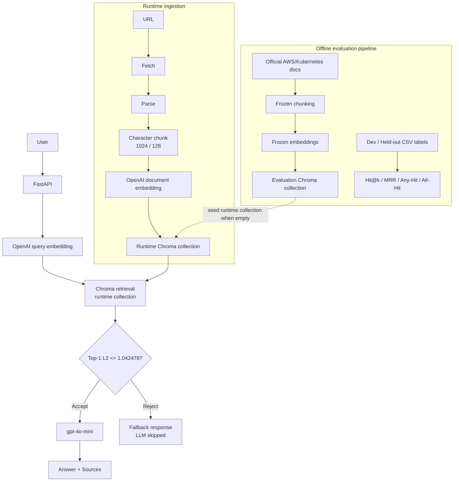

# CloudOps RAG

**English** | [한국어](./README.ko.md)

Evaluation-driven RAG for AWS and Kubernetes troubleshooting documentation.

CloudOps RAG is a FastAPI service that answers CloudOps troubleshooting questions with retrieved sources from official AWS and Kubernetes documentation. The project focuses less on making a fluent chatbot and more on measuring whether the system retrieves the right operational evidence, refuses unsupported questions, and exposes its limitations clearly.

The project story is:

```text
Built -> Measured -> Compared -> Frozen -> Held-out Validated
-> Answer Evaluated -> Failure Analyzed -> Improvement Hypothesis Tested
-> Served -> Monitored
```

## Key Results

The frozen configuration is:

```text
chunk_size = 1024
chunk_overlap = 128
chunk_unit = character
embedding = OpenAI text-embedding-3-small
vector DB = Chroma
retrieval_top_k = 5
threshold = top-1 Chroma L2 distance <= 1.042478
generation model = gpt-4o-mini
```

Retrieval evaluation measures whether expected source documents were retrieved. Answer evaluation is separate and measures whether generated answers were correct, complete, faithful, and source-supported.

| Area | Result |
|---|---|
| Corpus | 20 official AWS/Kubernetes troubleshooting documents |
| Retrieval dataset | 50 manually written questions |
| Development split | 40 total: 36 in-scope, 4 out-of-scope |
| Held-out split | 10 total: 8 in-scope, 2 out-of-scope |
| Dev retrieval | Hit@3 = 33/36 in-scope |
| Held-out retrieval | Hit@1 = 7/8, Hit@3 = 8/8, MRR = 0.9375 |
| Dev threshold/fallback | 36/36 in-scope accepted, 4/4 out-of-scope rejected |
| Held-out threshold/fallback | 8/8 in-scope accepted, 2/2 out-of-scope rejected |
| Answer diagnostic | 14 questions: 11 generated answers, 3 fallback cases |
| Human answer scores | Correctness 15/22 (1.36/2), Completeness 13/22 (1.18/2), Faithfulness 21/22 (1.91/2), Source Support 18/22 (1.64/2) |
| Judge-human agreement | 39/44 exact, 44/44 within one point |

On the 8 in-scope held-out questions, the frozen configuration retrieved the expected document within Top-3 for 8/8 questions. The held-out set is intentionally small, so this should be read as a validation snapshot, not a broad benchmark.

## Why This Project

Cloud troubleshooting is different from open-ended chat. In AWS and Kubernetes operations, a useful assistant should find the relevant official document, avoid answering when evidence is weak, and handle cases where multiple documents are needed together.

For that reason, this project evaluates the RAG system in layers:

- Retrieval quality: did the expected evidence document appear?
- Threshold/fallback: did unsupported questions skip generation?
- Answer quality: did the generated answer use retrieved evidence correctly?
- Failure analysis: where did retrieval or generation break down?
- Service engineering: can the evaluated pipeline be served, ingested into, containerized, and monitored?

This is the main distinction from a simple RAG tutorial. The project is designed around measurement and failure analysis, not only around connecting documents to an LLM.

## Architecture

Evaluation and runtime collections are intentionally separate. Experiment results stay tied to the frozen evaluation collection, while runtime document registration writes to a mutable runtime collection.



See [Architecture](docs/ARCHITECTURE.md), [REST API](docs/API.md), and [Document Ingestion](docs/INGESTION.md) for implementation details.

## Evaluation Methodology

The retrieval dataset contains 50 manually written CloudOps questions over 20 official documents.

| Split | Total | In-scope | Out-of-scope | Use |
|---|---:|---:|---:|---|
| Development | 40 | 36 | 4 | Chunking, embedding, Top-k, and threshold selection |
| Held-out Test | 10 | 8 | 2 | One-time validation after freezing |

Ground truth uses expected document IDs, not chunk IDs, because chunk boundaries change when chunk size and overlap change.

Retrieval metrics:

- Hit@k: whether an expected document appears within rank k.
- MRR: how highly the first expected document is ranked within the stated evaluation depth.
- Multi Any-Hit: at least one expected document appears.
- Multi All-Hit: all expected documents appear.
- Threshold acceptance/rejection: whether in-scope questions are accepted and out-of-scope questions are rejected before generation.

Answer quality was evaluated separately on a 14-question diagnostic subset. It is not mixed with retrieval Hit@k. Retrieval asks, "Did we find the expected evidence?" Answer evaluation asks, "Did the system use retrieved evidence to produce a correct, complete, grounded answer?"

See [Evaluation Summary](docs/EVALUATION_SUMMARY.md), [Held-out Evaluation](docs/HELDOUT_EVALUATION.md), [Answer Evaluation](docs/ANSWER_EVALUATION.md), and [Answer Evaluation Human Review](docs/ANSWER_EVALUATION_HUMAN_REVIEW.md).

## Experiment Summary

The Development set was used to compare the main retrieval choices, then the selected configuration was frozen before Held-out Test evaluation.

| Step | Decision | Evidence |
|---|---|---|
| Chunking | `1024/128` character chunks | Dev Hit@3 improved from 32/36 to 33/36 versus `512/0`, while Hit@1 and MRR decreased |
| Embedding | OpenAI `text-embedding-3-small` | Dev Hit@3 = 33/36 versus 31/36 for local MiniLM under the selected chunking |
| Top-k | `k=5` | Overall Hit matched k=3, but Dev Multi All-Hit improved from 0/6 to 2/6 |
| Threshold | L2 midpoint `1.042478` | Dev accepted 36/36 in-scope and rejected 4/4 out-of-scope |

These are small-sample engineering decisions, not universal claims. Detailed experiment notes are in [Chunking Experiments](docs/CHUNKING_EXPERIMENTS.md), [Embedding Experiments](docs/EMBEDDING_EXPERIMENTS.md), [Top-k Experiments](docs/TOP_K_EXPERIMENTS.md), [Threshold Experiments](docs/THRESHOLD_EXPERIMENTS.md), and [Final Configuration](docs/FINAL_CONFIGURATION.md).

MRR values in this repository are reported with their evaluation scope. The final audit explains why raw-depth-10 MRR and final-Top-5-only MRR should not be compared as the same metric definition. See [Final Technical Audit](docs/FINAL_TECHNICAL_AUDIT.md).

## Threshold And Fallback

The service uses a simple distance gate before generation:

```text
top_1_l2_distance <= 1.042478 -> accept, call gpt-4o-mini
top_1_l2_distance >  1.042478 -> reject, return fallback, skip LLM
```

This separates controlled fallback from external dependency failure. Fallback is a successful response when retrieval confidence is too low. OpenAI timeout or dependency failure is an API error path.

The threshold worked on the small Dev and Held-out OOS samples, but it does not solve high-confidence semantic misretrieval. For example, a ConfigMap-focused question can still retrieve high-confidence Secrets context.

## Answer Evaluation

The diagnostic answer evaluation used 14 questions:

- 11 generated answers.
- 3 fallback cases.
- Human verification for all 11 generated answers.
- LLM-as-a-Judge agreement checked against human scores.

Human scores over 11 generated answers:

| Dimension | Score |
|---|---:|
| Correctness | 15/22 (1.36 / 2) |
| Completeness | 13/22 (1.18 / 2) |
| Faithfulness | 21/22 (1.91 / 2) |
| Source Support | 18/22 (1.64 / 2) |

The diagnostic results suggest that lower answer correctness was not caused by retrieval failures alone. Human review classified the 11 generated answers as 4 generation-side failures, 2 combined retrieval/generation failures, 1 retrieval failure, and 4 no-material-failure cases. Several reviewed cases had relevant evidence available but the answer omitted or underused a required comparison, diagnostic step, or key point; other cases propagated incomplete or incorrect retrieval context into the final answer.

The most important lesson was that faithfulness is not the same as correctness. In `eval_027`, the system retrieved Secrets-focused context for a ConfigMap question. The answer stayed grounded in the retrieved context, but the retrieved context did not answer the actual question well, so correctness and source support were poor.

`eval_045` showed a different nuance: the exact expected document was not retrieved, but another Auto Scaling document contained enough evidence to support the answer. This is why document-level retrieval metrics and answer-level source support are related but not identical.

## Failure Analysis

The strongest unresolved weakness is multi-document completeness.

| Split | Multi Any-Hit@5 | Multi All-Hit@5 |
|---|---:|---:|
| Development | 6/6 | 2/6 |
| Held-out | 3/3 | 0/3 |

The system often retrieves one relevant document, but does not reliably retrieve every required evidence document for questions that need multiple sources.

Observed pattern:

- Top-k results often contain repeated chunks from one document.
- Held-out Top-5 average unique document count was 2.10.
- Held-out Top-5 average duplicate chunk count was 2.90.
- Held-out duplicate ratio was 0.58.

This supports the duplicate-occupancy hypothesis as one likely factor, not the only cause. Semantic confusion also remains visible, especially ConfigMap/Secrets cases.

## Diversification Candidate

After the frozen held-out evaluation, a post-hoc Development-set experiment applied a per-document chunk cap of 2 while preserving dense similarity order.

| Dev metric | Baseline | cap=2 candidate |
|---|---:|---:|
| Multi All-Hit@5 | 2/6 | 4/6 |
| Average unique documents | 1.975 | 2.95 |
| Duplicate ratio | 0.605 | 0.365 |

This supported the duplicate-occupancy hypothesis as a promising direction. In `eval_007`, Secrets chunks occupied the Top-5 baseline, and cap=2 allowed the ConfigMap document to enter the Top-5.

The cap=2 retriever is not part of the frozen configuration. It was tested post-hoc on the Development set only and was not validated on a new untouched held-out set. It also cannot fix cases where the relevant document is absent from the raw candidate pool, such as `eval_027`.

See [Retrieval Diversification](docs/RETRIEVAL_DIVERSIFICATION.md).

## Service Engineering

Implemented API surface:

| Endpoint | Purpose |
|---|---|
| `GET /health` | Health check without calling OpenAI |
| `GET /metrics` | Prometheus-compatible metrics |
| `POST /query` | Retrieval, threshold fallback, generation, answer, sources |
| `POST /documents` | Synchronous runtime document ingestion |
| `GET /documents/{id}/status` | Runtime ingestion status |

Runtime ingestion:

```text
URL -> Fetch -> Parse -> Chunk -> Embed -> Runtime Chroma
```

Engineering choices:

- Stable URL-based runtime document IDs.
- Duplicate URL handling without appending duplicate chunks.
- Evaluation collection separated from runtime collection.
- Synchronous ingestion for portfolio-scale simplicity.
- Docker runtime with non-root user, healthcheck, and bind-mount persistence.
- `.env` secrets are not baked into the image.
- Docker image size was measured at `1.07GB` in `docker images` on the current build. A container-level audit showed that most of the runtime filesystem comes from Python dependencies (`/usr/local/lib/python3.12/site-packages`: 647MB), while `/app` project files contribute about 2MB.

Failure handling:

- Embedding timeout: 30s.
- Generation timeout: 45s.
- Timeout response: `504 external_dependency_timeout`.
- Non-timeout dependency failure: `503 external_dependency_unavailable`.
- Fallback is not an exception path; it is a controlled low-confidence retrieval response.
- Application-level retry/backoff is not implemented yet and remains future production hardening.

See [REST API](docs/API.md), [Document Ingestion](docs/INGESTION.md), and [Docker](docs/DOCKER.md).

## Monitoring

The service exposes Prometheus-compatible metrics at:

```text
GET /metrics
```

Metric coverage includes HTTP latency, query latency, embedding latency, retrieval latency, generation latency, fallback count, ingestion metrics, and OpenAI failure metrics. Labels avoid high-cardinality user content such as question text, answers, document URLs, `doc_id`, `chunk_id`, and raw exception messages.

See [Monitoring](docs/MONITORING.md).

## Quick Start

Use Python 3.12 for reproducing the current runtime and Docker path.

### Local Python

```bash
git clone https://github.com/andrewkimswe/cloudops-rag.git
cd cloudops-rag
python3.12 -m venv .venv312
source .venv312/bin/activate
python -m pip install --upgrade pip
python -m pip install ".[dev]"
cp .env.example .env
```

Set `OPENAI_API_KEY` in `.env`. Do not commit `.env`.

Fetch and index the official corpus:

```bash
PYTHONPATH=src python scripts/fetch_corpus.py
PYTHONPATH=src python scripts/ingest.py
```

Run the API:

```bash
PYTHONPATH=src uvicorn cloudops_rag.api.app:app --reload
```

Smoke check:

```bash
curl http://localhost:8000/health
curl http://localhost:8000/metrics
```

Query:

```bash
curl -X POST http://localhost:8000/query \
  -H "Content-Type: application/json" \
  -d '{"question":"Why is my Kubernetes Pod stuck in Pending?"}'
```

Install the optional local embedding dependency only when reproducing the MiniLM experiment:

```bash
python -m pip install ".[local]"
```

### Docker

```bash
docker build -t cloudops-rag:latest .
docker run --rm \
  --env-file .env \
  -p 8000:8000 \
  -v "$(pwd)/indexes/chroma:/app/indexes/chroma" \
  -v "$(pwd)/data/runtime:/app/data/runtime" \
  cloudops-rag:latest
```

## API Example

```http
POST /query
Content-Type: application/json
```

```json
{
  "question": "Why is my Kubernetes Pod stuck in Pending?"
}
```

Response shape:

```json
{
  "question": "Why is my Kubernetes Pod stuck in Pending?",
  "answer": "...",
  "fallback": false,
  "sources": [
    {
      "doc_id": "k8s_debug_pods",
      "title": "Debug Pods",
      "source_url": "https://kubernetes.io/docs/tasks/debug/debug-application/debug-pods/",
      "rank": 1
    }
  ],
  "debug": null
}
```

Out-of-scope fallback responses set `fallback=true`, return no sources, and skip the LLM call.

## Project Structure

| Path | Role |
|---|---|
| [src/cloudops_rag/](src/cloudops_rag/) | Application package: ingestion, chunking, embedding, retrieval, generation, API, config |
| [data/manifests/](data/manifests/) | Official source inventory |
| [data/evaluation/](data/evaluation/) | Retrieval evaluation datasets |
| [results/](results/) | Raw experiment outputs and summaries |
| [scripts/](scripts/) | CLI entry points for fetching, indexing, querying, and evaluations |
| [tests/](tests/) | Unit, API, and monitoring tests |
| [docs/](docs/) | Detailed decisions, experiments, service docs, and audit notes |

## Technology Stack

- Python 3.12 for runtime and Docker verification.
- FastAPI and Uvicorn for the REST API.
- OpenAI `text-embedding-3-small` for the frozen embedding path.
- OpenAI `gpt-4o-mini` for answer generation.
- Chroma for local persistent vector storage.
- LangChain used selectively for RAG integration points.
- `sentence-transformers/all-MiniLM-L6-v2` as an optional local embedding experiment candidate.
- BeautifulSoup for HTML parsing and cleaning.
- pandas and numpy for evaluation/result analysis.
- pytest and httpx for tests.
- Docker for reproducible service runtime.
- Prometheus client for application metrics.

## Limitations

- Corpus is small: 20 official documents.
- Retrieval dataset is small: 50 questions.
- Held-out Test is very small: 10 questions, with 8 in-scope and 2 out-of-scope.
- OOS evaluation is especially sample-sensitive.
- Evaluation questions and labels were manually constructed.
- Corpus is specific to AWS/Kubernetes CloudOps troubleshooting.
- Tuning was sequential, not a global search across all combinations.
- Chunking experiments used character-based chunking only.
- Multi-document retrieval completeness remains weak.
- ConfigMap/Secrets semantic confusion persists.
- Answer evaluation is diagnostic-scale, not a broad answer-quality benchmark.
- LLM-as-a-Judge results were human-checked, but still cover only 11 generated answers.
- Threshold fallback does not prevent high-confidence semantic misretrieval.
- No production retry/backoff layer yet.
- The cap=2 diversification candidate has not been validated on a new untouched held-out set.
- Docker image size remains large: the current audit showed `1.07GB` in `docker images`, driven primarily by runtime dependency packaging rather than application source size.

## Future Work

1. Expand the corpus and retrieval evaluation set.
2. Create a new untouched validation set for retrieval diversification.
3. Compare MMR, reranking, and hybrid retrieval.
4. Add query rewriting for multi-intent troubleshooting questions.
5. Use metadata-aware retrieval for provider/category/source filtering.
6. Improve multi-document evidence retrieval.
7. Add bounded retry/backoff for retryable external failures.
8. Expand answer-quality evaluation beyond the current diagnostic subset.
9. Run controlled generation experiments that hold retrieval context fixed while varying prompt or generation model configuration.
10. Explore token-based, section-aware, or semantic chunking.
11. Reduce Docker image size.

## Detailed Documentation

- [Final Technical Audit](docs/FINAL_TECHNICAL_AUDIT.md)
- [Portfolio Summary](docs/PORTFOLIO_SUMMARY.md)
- [Technical Decisions](docs/DECISIONS.md)
- [Architecture](docs/ARCHITECTURE.md)
- [Final Configuration](docs/FINAL_CONFIGURATION.md)
- [Evaluation Summary](docs/EVALUATION_SUMMARY.md)
- [Held-out Evaluation](docs/HELDOUT_EVALUATION.md)
- [Threshold Experiments](docs/THRESHOLD_EXPERIMENTS.md)
- [Answer Evaluation](docs/ANSWER_EVALUATION.md)
- [Answer Evaluation Human Review](docs/ANSWER_EVALUATION_HUMAN_REVIEW.md)
- [Retrieval Diversification](docs/RETRIEVAL_DIVERSIFICATION.md)
- [REST API](docs/API.md)
- [Document Ingestion](docs/INGESTION.md)
- [Docker](docs/DOCKER.md)
- [Monitoring](docs/MONITORING.md)
- [Experiment Interpretation](docs/EXPERIMENT_INTERPRETATION.md)
- [Chunking Experiments](docs/CHUNKING_EXPERIMENTS.md)
- [Embedding Experiments](docs/EMBEDDING_EXPERIMENTS.md)
- [Top-k Experiments](docs/TOP_K_EXPERIMENTS.md)
- [Limitations](docs/LIMITATIONS.md)

## License

This project is licensed under the MIT License. See [LICENSE](./LICENSE).
