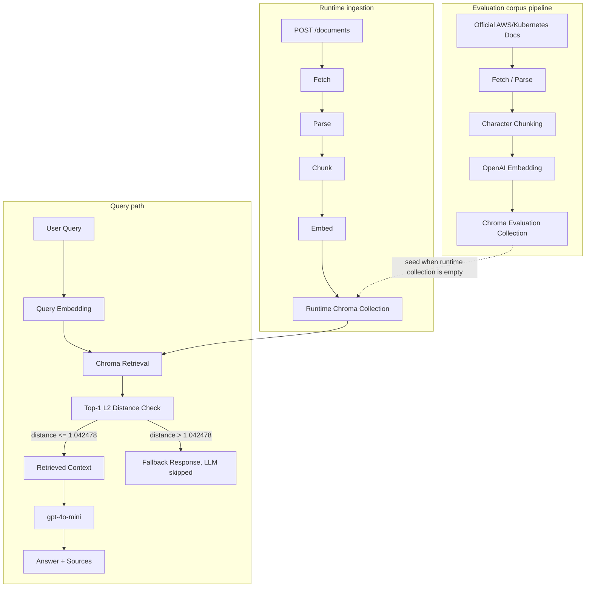
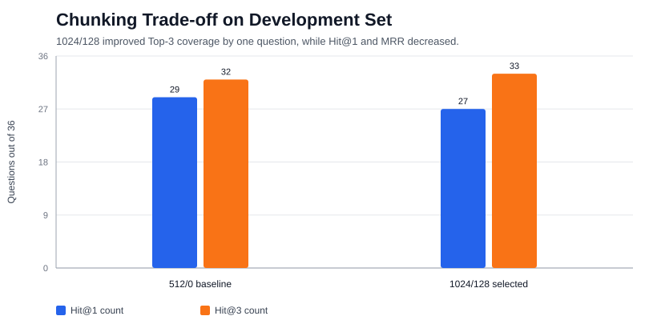
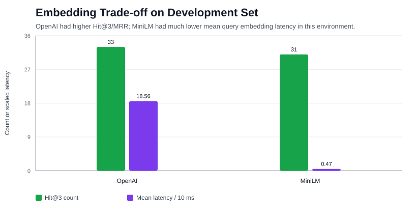
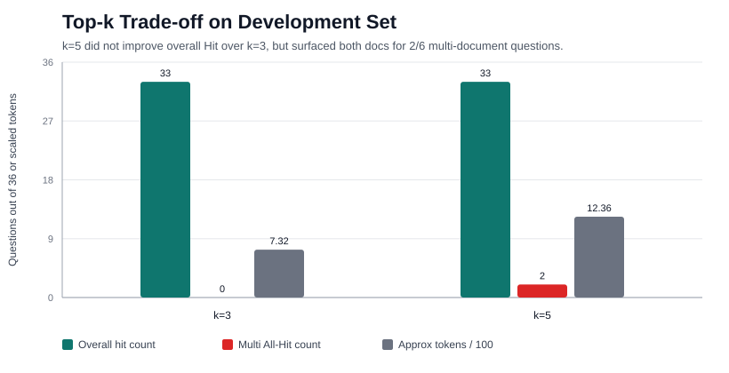

# CloudOps RAG

An evaluation-driven RAG system for AWS and Kubernetes troubleshooting documentation.

CloudOps RAG is a document-grounded question-answering service built on official AWS and Kubernetes operational documentation. The project does not stop at "documents -> vector DB -> LLM". It builds a retrieval evaluation dataset, measures retrieval quality, compares chunking, embedding, and Top-k choices, freezes a selected configuration, validates it on a held-out set, analyzes persistent failure modes, and exposes the evaluated pipeline through FastAPI, runtime document ingestion, Chroma persistence, and Docker.

The core engineering story is:

```text
Implementation -> Measurement -> Experiment -> Configuration Freeze
-> Held-out Validation -> Failure Analysis -> Service Engineering
```

## Highlights

- 20-document official AWS/Kubernetes CloudOps corpus.
- 50-question evaluation dataset with Development / Held-out split.
- Retrieval evaluation with Hit Rate@k, MRR, Multi-document Any-Hit, and Multi-document All-Hit.
- Controlled Development-set experiments for chunking, embedding model, Top-k, and similarity threshold.
- Frozen retrieval configuration validated once on a 10-question held-out set without retuning.
- FastAPI service with source-aware answers, threshold fallback, runtime ingestion, Chroma persistence, and Docker packaging.

## Key Results

These are retrieval and fallback results, not answer-quality results.

| Area | Result |
|---|---:|
| Corpus | 20 official AWS/Kubernetes documents |
| Evaluation dataset | 50 questions |
| Development set | 40 total, 36 in-scope, 4 out-of-scope |
| Held-out set | 10 total, 8 in-scope, 2 out-of-scope |
| Frozen chunking | 1024 characters / 128 overlap |
| Frozen embedding | OpenAI `text-embedding-3-small` |
| Frozen vector DB | Chroma |
| Frozen Top-k | 5 |
| Frozen threshold | Top-1 Chroma L2 distance <= `1.042478` |
| Held-out Hit@1 | 87.50% (7/8 in-scope) |
| Held-out Hit@3 | 100.00% (8/8 in-scope) |
| Held-out Hit@5 | 100.00% (8/8 in-scope) |
| Held-out MRR | 0.9375 |
| Held-out threshold result | 8 true accepts, 0 false rejects, 2 true rejects, 0 false accepts |

On the 8 in-scope held-out questions, the frozen configuration retrieved the expected document within Top-3 for 8/8 questions. These held-out results are based on a small 10-question test set and should be interpreted as a validation snapshot, not as a general benchmark.

Both baseline and final configurations achieved configured-cutoff coverage of 8/8 on the held-out set. The final configuration showed a higher MRR (0.9375 vs 0.8333), but the test set is too small to claim a general ranking improvement.

## What Makes This Different

A common RAG tutorial often follows this path:

```text
Documents -> Vector DB -> LLM -> Answer
```

This project follows a measurement-first path:

```mermaid
flowchart LR
  A["Official AWS/Kubernetes docs"] --> B["RAG baseline"]
  B --> C["Evaluation dataset"]
  C --> D["Retrieval metrics"]
  D --> E["Controlled experiments"]
  E --> F["Frozen configuration"]
  F --> G["Held-out validation"]
  G --> H["Failure analysis"]
  H --> I["Fallback"]
  I --> J["FastAPI service"]
  J --> K["Runtime ingestion"]
  K --> L["Docker"]
```



The emphasis is not only that the pipeline can answer questions, but that its retrieval behavior is measured, its configuration choices are explainable, and its limitations are kept visible.

## Architecture

The evaluation collection and runtime collection are intentionally separate. Phase 7-13 experiment results remain tied to the frozen evaluation collection, while the API writes newly registered documents only to the mutable runtime collection.



See [Architecture](docs/ARCHITECTURE.md) for package boundaries and collection names.

## Evaluation Design

The corpus contains 20 official AWS/Kubernetes CloudOps and troubleshooting documents listed in [data/manifests/documents.csv](data/manifests/documents.csv).

The evaluation dataset contains 50 manually written operational questions:

| Split | Total | In-scope | Out-of-scope |
|---|---:|---:|---:|
| Development | 40 | 36 | 4 |
| Held-out Test | 10 | 8 | 2 |
| Total | 50 | 44 | 6 |

Question types include `single-troubleshooting`, `single-conceptual`, `contextual`, `discrimination`, `multi-document`, and `out-of-scope`.

Ground truth is labeled by `doc_id`, not `chunk_id`. This keeps labels stable when chunk size and overlap change. A chunk boundary can move across experiments, but the expected source document should remain stable.

Metrics:

- Hit Rate@k: whether an expected document appears within the retrieved cutoff.
- MRR: how highly the first expected document is ranked.
- Multi-document Any-Hit: at least one expected document appears.
- Multi-document All-Hit: all expected documents appear.
- Threshold accept/reject: whether in-scope questions are accepted and out-of-scope questions are rejected before LLM generation.

The Development set was used for selecting chunking, embedding, Top-k, and threshold. The Held-out Test set was opened only after the configuration was frozen. No retuning was performed after held-out results were observed.

## Experiments

### Chunking

The Phase 7 baseline used `512/0` character chunking, OpenAI `text-embedding-3-small`, Chroma, and `top_k=3`.

Phase 8 selected `1024/128` for later experiments because it improved Top-3 document coverage by one question on the Development set:

| Configuration | Hit@1 | Hit@3 | MRR |
|---|---:|---:|---:|
| `512/0` baseline | 80.56% (29/36) | 88.89% (32/36) | 0.8651 |
| `1024/128` selected | 75.00% (27/36) | 91.67% (33/36) | 0.8408 |

This is a coverage-ranking trade-off. Top-3 coverage increased from 32/36 to 33/36, while Hit@1 and MRR decreased. Since the Development in-scope set has only 36 questions, one question changes Hit Rate by about 2.78 percentage points.



### Embedding

Phase 9 compared OpenAI `text-embedding-3-small` and `sentence-transformers/all-MiniLM-L6-v2` under the selected `1024/128` chunking setup.

| Embedding | Hit@3 | MRR | Mean query embedding latency |
|---|---:|---:|---:|
| OpenAI `text-embedding-3-small` | 91.67% (33/36) | 0.8408 | 185.60 ms |
| MiniLM `all-MiniLM-L6-v2` | 86.11% (31/36) | 0.8314 | 4.71 ms |

OpenAI was selected for the frozen pipeline because retrieval quality was the current priority. MiniLM is still a meaningful engineering option when local execution, offline operation, lower latency, no API key, and no per-query external API cost matter more than the observed Hit@3 difference. Latency is API, network, hardware, and environment dependent.



### Top-k

Phase 10 fixed `1024/128` and OpenAI embeddings, then compared k=1, k=3, and k=5. k=10 was used only as a diagnostic view.

| k | Overall Hit | MRR | Multi Any-Hit | Multi All-Hit | Approx context |
|---:|---:|---:|---:|---:|---:|
| 1 | 27/36 | 0.8408 | 5/6 | 0/6 | ~250 tokens |
| 3 | 33/36 | 0.8408 | 6/6 | 0/6 | ~732 tokens |
| 5 | 33/36 | 0.8408 | 6/6 | 2/6 | ~1236 tokens |
| 10 diagnostic | 35/36 | 0.8408 | 6/6 | 3/6 | ~2498 tokens |

k=5 was not selected because it improved overall Hit over k=3. It was selected because it improved multi-document All-Hit from 0/6 to 2/6 while keeping the context size manageable for this RAG v1 service.

The trade-off is larger context and more duplicate chunks. At k=5, the average unique document count was 1.975 and the duplicate ratio was 0.605.



## Threshold and Fallback

Chroma returned distances for this collection. Lower L2 distance means more similar.

The fallback gate uses the Top-1 retrieved chunk distance:

```text
top_1_l2_distance <= 1.042478 -> accept and allow LLM generation
top_1_l2_distance >  1.042478 -> reject, skip LLM, return fallback
```

The selected threshold is the midpoint between the Development-set max in-scope distance and min out-of-scope distance:

| Development signal | Value |
|---|---:|
| Max in-scope distance | 1.0350 |
| Min out-of-scope distance | 1.0500 |
| Selected midpoint threshold | 1.042478 |

Development result: 36/36 in-scope accepted and 4/4 out-of-scope rejected.

Held-out result: 8/8 in-scope accepted and 2/2 out-of-scope rejected.

This threshold is corpus-dependent and sample-sensitive. The Development OOS set has only 4 questions, and the Held-out OOS set has only 2. The threshold does not solve semantic misretrieval, multi-document completeness, hallucination, or answer correctness.

## Held-out Evaluation

After chunking, embedding, Top-k, and threshold were selected on the Development set, the frozen configuration was evaluated once on the Held-out Test set.

Frozen configuration:

```text
chunk_size = 1024
chunk_overlap = 128
chunk_unit = character
embedding_model = OpenAI text-embedding-3-small
vector_db = Chroma
retrieval_top_k = 5
threshold = 1.042478
llm = gpt-4o-mini
```

Held-out retrieval on 8 in-scope questions:

| Metric | Result |
|---|---:|
| Hit@1 | 87.50% (7/8) |
| Hit@3 | 100.00% (8/8) |
| Hit@5 | 100.00% (8/8) |
| MRR | 0.9375 |

Single-document held-out questions worked well in this small set: 5/5 succeeded at all cutoffs. Multi-document retrieval remained weak: Any-Hit@5 was 3/3, but All-Hit@5 was 0/3.

## Failure Analysis

The most important unresolved issue is multi-document completeness.

Development:

- Multi Any-Hit@5 = 6/6
- Multi All-Hit@5 = 2/6

Held-out:

- Multi Any-Hit@5 = 3/3
- Multi All-Hit@5 = 0/3

The retriever often finds one relevant document but does not reliably retrieve every required evidence document for multi-document CloudOps questions.

Observed held-out failures:

| Case | Observed behavior |
|---|---|
| ConfigMaps + Secrets | Secrets chunks dominated Top-5; ConfigMaps was missing. |
| ALB + Auto Scaling | ALB appeared, but the Auto Scaling health-check document was ranked too low. |
| RDS + VPC Reachability | RDS dominated Top-5; Reachability Analyzer was missing. |

Document diversity on held-out Top-5:

| Metric | Value |
|---|---:|
| Average unique doc count | 2.10 |
| Average duplicate chunk count | 2.90 |
| Average duplicate ratio | 0.58 |
| Max same-document occupancy | 5 |

These results are consistent with the duplicate-chunk hypothesis observed in this corpus and evaluation: multiple chunks from one document can occupy Top-k positions and push a second evidence document out of the context. This is evidence for one plausible cause, not proof of the only cause.

## Service Engineering

The evaluated retrieval pipeline is exposed through FastAPI:

| Endpoint | Purpose |
|---|---|
| `GET /health` | Check API and Chroma collection availability without calling OpenAI. |
| `POST /query` | Run retrieval, threshold fallback, generation, and source return. |
| `POST /documents` | Synchronously fetch, parse, chunk, embed, and index one runtime document. |
| `GET /documents/{id}/status` | Return persisted runtime ingestion status. |

Service behavior:

- Returns `answer`, `sources`, and `fallback`.
- Skips the LLM call when the threshold rejects a query.
- Keeps route handlers thin and service logic testable.
- Uses a runtime Chroma collection separate from the frozen evaluation collection.
- Seeds the runtime collection from the evaluation collection when empty.
- Persists runtime document status in local JSON.

See [REST API](docs/API.md) for request/response contracts.

## Runtime Document Ingestion

Runtime ingestion is intentionally synchronous for the current project scale:

```text
URL -> fetch -> parse -> chunk -> embed -> runtime Chroma -> completed
```

Status lifecycle:

```text
pending -> processing -> completed
failed
```

Duplicate policy:

- Runtime `doc_id` is stable: `registered_<sha1(source_url)[:12]>`.
- A completed duplicate URL returns the existing record with `duplicate=true`.
- Duplicate chunks are not appended.

Measured local ingestion examples completed in about 0.82s to 4.30s:

| Document | Processed chars | Chunks | Total time |
|---|---:|---:|---:|
| Kubernetes debug cluster | 20,083 | 23 | 4,300.14 ms |
| Kubernetes DNS debugging | 13,359 | 15 | 2,538.71 ms |
| AWS EKS troubleshooting | 54,536 | 61 | 821.49 ms |

For this portfolio-scale API, synchronous ingestion keeps behavior explainable. Large documents, concurrent ingestion, retry queues, or timeout-sensitive clients would justify a background worker later.

See [Document Ingestion](docs/INGESTION.md) for lifecycle and failure handling.

## Docker

The service is packaged with Docker:

- Base image: `python:3.12.14-slim-bookworm`.
- Runtime user: non-root `appuser`.
- Health check: Python stdlib request to `GET /health`.
- Secrets: `.env` is excluded from the image and injected at runtime.
- Persistence: bind mounts for `/app/indexes/chroma` and `/app/data/runtime`.
- Runtime image excludes local indexes, raw documents, processed documents, runtime status, experiment results, and optional local embedding dependencies.

Observed image size after Phase 17 verification was about 1.06GB. This is a current limitation and a future optimization target, not a benefit.

See [Docker](docs/DOCKER.md) for build, run, persistence, and smoke-test details.

## Limitations

This project is intentionally small and controlled.

- Corpus size: 20 documents.
- Evaluation size: 50 questions.
- Held-out size: 10 questions, with only 8 in-scope and 2 out-of-scope.
- One held-out in-scope question changes percentages by 12.5 percentage points.
- One held-out out-of-scope question changes rejection rate by 50 percentage points.
- Evaluation questions and labels are manual.
- The corpus is domain-specific to AWS/Kubernetes CloudOps troubleshooting.
- Tuning was sequential, not a global search across all chunking, embedding, Top-k, and threshold combinations.
- Chunking experiments used character-based chunking only.
- Current evaluation is retrieval-focused.
- Answer correctness, faithfulness, citation correctness, and hallucination rate are not formally evaluated.
- Retrieving the expected document does not guarantee a correct or faithful generated answer.
- Multi-document completeness remains weak.
- ConfigMap/Secrets semantic confusion persists.
- Runtime corpus expansion can change distance distributions, so the threshold may need recalibration.
- Docker image size is about 1.06GB.

## Future Work

Potential next experiments:

- Formal answer-quality evaluation.
- Citation correctness and faithfulness checks.
- MMR or document-diversity retrieval.
- Document-level deduplication or per-document chunk caps.
- Reranking.
- Hybrid BM25 + dense retrieval.
- Metadata-aware retrieval.
- Query rewriting for multi-intent troubleshooting questions.
- Token-based, section-aware, or semantic chunking.
- Larger AWS/Kubernetes corpus and larger held-out evaluation set.
- Monitoring in Phase 18 of the original project plan.

## Quick Start

### Local Python

Use Python 3.12 when reproducing the current runtime and Docker path.

```bash
git clone <repository-url>
cd <repository-directory>
python3.12 -m venv .venv312  # use your local Python 3.12 launcher
source .venv312/bin/activate
python -m pip install --upgrade pip
python -m pip install ".[dev]"
cp .env.example .env
```

Set `OPENAI_API_KEY` in `.env`. Do not commit `.env`.

Fetch and index the official corpus:

```bash
PYTHONPATH=src python scripts/fetch_corpus.py
PYTHONPATH=src python scripts/ingest.py
```

Run the API:

```bash
PYTHONPATH=src uvicorn cloudops_rag.api.app:app --reload
```

Check health:

```bash
curl http://localhost:8000/health
```

Query:

```bash
curl -X POST http://localhost:8000/query \
  -H "Content-Type: application/json" \
  -d '{"question":"Why is my Kubernetes Pod stuck in Pending?"}'
```

Install the optional local embedding dependency only when reproducing the MiniLM experiment:

```bash
python -m pip install ".[local]"
```

### Docker

```bash
docker build -t cloudops-rag:latest .
docker run --rm \
  --env-file .env \
  -p 8000:8000 \
  -v "$(pwd)/indexes/chroma:/app/indexes/chroma" \
  -v "$(pwd)/data/runtime:/app/data/runtime" \
  cloudops-rag:latest
```

## API Example

Request:

```http
POST /query
Content-Type: application/json
```

```json
{
  "question": "Why is my Kubernetes Pod stuck in Pending?"
}
```

Response shape:

```json
{
  "question": "Why is my Kubernetes Pod stuck in Pending?",
  "answer": "...",
  "fallback": false,
  "sources": [
    {
      "doc_id": "k8s_debug_pods",
      "title": "Debug Pods",
      "source_url": "https://kubernetes.io/docs/tasks/debug/debug-application/debug-pods/",
      "rank": 1
    }
  ],
  "debug": null
}
```

Out-of-scope fallback responses set `fallback=true`, return no sources, and skip the LLM call.

## Project Structure

| Path | Role |
|---|---|
| [src/cloudops_rag/](src/cloudops_rag/) | Application package: ingestion, chunking, embedding, retrieval, generation, API, config. |
| [data/manifests/](data/manifests/) | Official source inventory. |
| [data/evaluation/](data/evaluation/) | Seed, full, development, and held-out evaluation datasets. |
| [results/](results/) | Raw experiment outputs and summaries from Phases 7-13 and ingestion benchmarking. |
| [scripts/](scripts/) | CLI entry points for fetching, indexing, querying, and running evaluations. |
| [tests/](tests/) | Unit and API tests. |
| [docs/](docs/) | Detailed decisions, experiments, architecture, API, ingestion, Docker, summary, and limitations. |

## Technology Stack

- Python 3.12 for runtime and Docker verification.
- FastAPI and Uvicorn for the REST API.
- OpenAI `text-embedding-3-small` for the frozen embedding path.
- OpenAI `gpt-4o-mini` for answer generation.
- Chroma for local persistent vector storage.
- LangChain used selectively for RAG integration points.
- `sentence-transformers/all-MiniLM-L6-v2` as an optional local embedding experiment candidate.
- BeautifulSoup for HTML parsing and cleaning.
- pandas and numpy for evaluation/result analysis.
- pytest and httpx for tests.
- Docker for reproducible service runtime.

## Detailed Documentation

- [Technical Decisions](docs/DECISIONS.md)
- [Architecture](docs/ARCHITECTURE.md)
- [RAG v1](docs/RAG_V1.md)
- [Experiment Interpretation](docs/EXPERIMENT_INTERPRETATION.md)
- [Chunking Experiments](docs/CHUNKING_EXPERIMENTS.md)
- [Embedding Experiments](docs/EMBEDDING_EXPERIMENTS.md)
- [Top-k Experiments](docs/TOP_K_EXPERIMENTS.md)
- [Threshold Experiments](docs/THRESHOLD_EXPERIMENTS.md)
- [Final Configuration](docs/FINAL_CONFIGURATION.md)
- [Held-out Evaluation](docs/HELDOUT_EVALUATION.md)
- [Evaluation Summary](docs/EVALUATION_SUMMARY.md)
- [Limitations](docs/LIMITATIONS.md)
- [REST API](docs/API.md)
- [Document Ingestion](docs/INGESTION.md)
- [Docker](docs/DOCKER.md)
